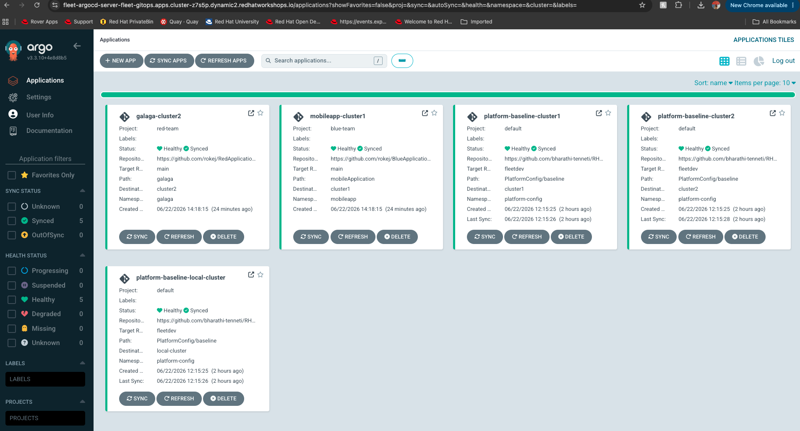
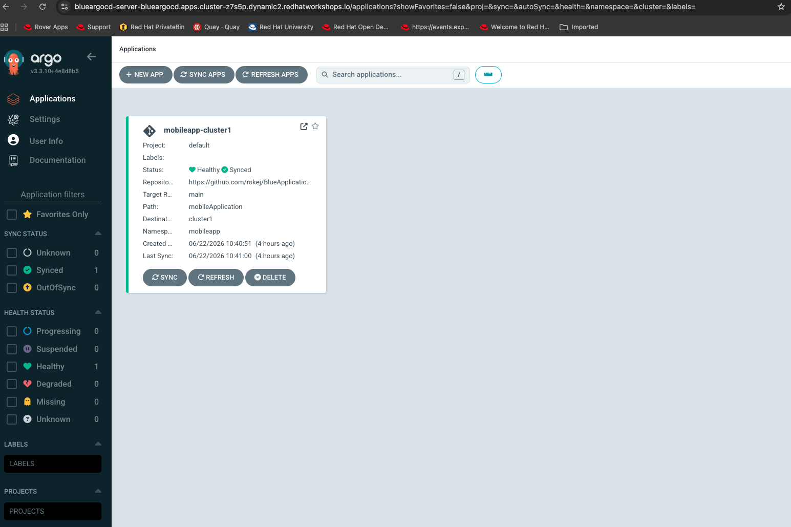
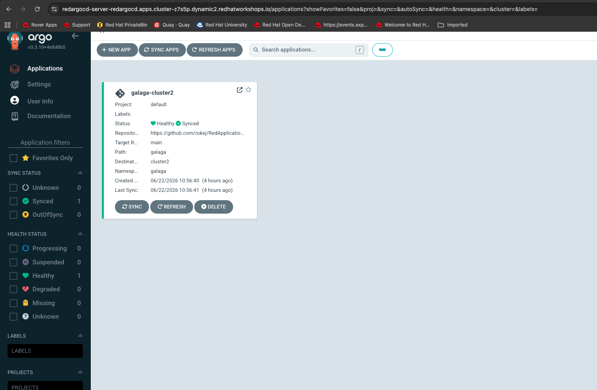

# RHACM GitOps Multi-Tenancy Demo

Fleet-wide GitOps using Red Hat Advanced Cluster Management and OpenShift GitOps. A single `fleet-argocd` instance on the hub delivers platform config and all tenant applications across all clusters. ArgoCD AppProjects provide tenant isolation — each team sees only their own applications. Platform admins have a single pane of glass.


## Prerequisites

- 1 OpenShift hub cluster with RHACM installed
- Managed clusters imported into ACM and assigned to ClusterSets
- OpenShift GitOps operator **≥ 1.10** on hub

## Architecture

```
fleet-argocd (fleet-gitops namespace on hub)
├── AppProject: default    → platform-baseline → all clusters        (acm-sre-group: admin)
├── AppProject: blue-team  → mobile-app         → blueclusterset     (blue-sre-group: admin)
└── AppProject: red-team   → galaga              → redclusterset      (red-sre-group: admin)

ACM GitOpsCluster + Placements register all clusters to fleet-argocd:
  fleet-placement  → global ManagedClusterSet (all clusters)
  blue-placement   → blueclusterset only
  red-placement    → redclusterset only
```

## Repository structure

```
.
├── kustomization.yaml                         # Hub resources (UsersGroups + AcmPolicies)
├── AcmPolicies/
│   ├── InstallGitOpsOperator/                 # Install GitOps operator on hub
│   ├── ArgoCDInstances/                       # Per-tenant ArgoCD instances (blueargocd, redargocd)
│   ├── RegisterClustersToArgoCDInstances/     # Register tenant ClusterSets to per-tenant ArgoCD
│   ├── FleetArgoCD/                           # fleet-argocd instance in fleet-gitops namespace
│   └── RegisterAllClustersToFleet/            # Register all clusters to fleet-argocd via GitOpsCluster
├── ApplicationSets/
│   └── fleet/
│       ├── fleetPlatformAppset.yaml           # Platform baseline → all clusters (default project)
│       ├── blueMobileAppset.yaml              # Mobile app → blueclusterset (blue-team project)
│       ├── redGalagaAppset.yaml               # Galaga → redclusterset (red-team project)
│       ├── blueTeamAppProject.yaml            # AppProject: blue-team
│       └── redTeamAppProject.yaml             # AppProject: red-team
├── PlatformConfig/baseline/                   # Deployed by fleet-argocd to spokes (not applied to hub)
└── UsersGroups/                               # Users, Groups, HTPasswd OAuth config
```

---

## Setup steps

### Step 1 — Create users and groups on the hub

```bash
oc create secret generic htpass-secret \
  --from-file=htpasswd=./UsersGroups/htpasswd \
  -n openshift-config

oc apply -k ./UsersGroups
```

### Step 2 — Grant ACM group cluster-wide RBAC

```bash
oc adm policy add-cluster-role-to-group cluster-admin acm-sre-group
oc adm policy add-cluster-role-to-group view acm-viewer-group
```

### Step 3 — Create ClusterSets, assign clusters, and grant group access

Create the ClusterSets:

```bash
oc apply -f - <<'EOF'
apiVersion: cluster.open-cluster-management.io/v1beta2
kind: ManagedClusterSet
metadata:
  name: blueclusterset
---
apiVersion: cluster.open-cluster-management.io/v1beta2
kind: ManagedClusterSet
metadata:
  name: redclusterset
EOF
```

Assign your managed clusters to the correct ClusterSet (replace names with your actual cluster names):

```bash
oc label managedcluster <blue-cluster-1> cluster.open-cluster-management.io/clusterset=blueclusterset
oc label managedcluster <red-cluster-1>  cluster.open-cluster-management.io/clusterset=redclusterset
```

Grant group access to each ClusterSet:

```bash
oc adm policy add-cluster-role-to-group open-cluster-management:managedclusterset:admin:blueclusterset blue-sre-group
oc adm policy add-cluster-role-to-group open-cluster-management:managedclusterset:view:blueclusterset  blue-viewer-group
oc adm policy add-cluster-role-to-group open-cluster-management:managedclusterset:admin:redclusterset  red-sre-group
oc adm policy add-cluster-role-to-group open-cluster-management:managedclusterset:view:redclusterset   red-viewer-group
```

### Step 4 — Install GitOps operator on hub

```bash
oc apply -k ./AcmPolicies/InstallGitOpsOperator
```

Wait until all pods in `openshift-gitops` are `Running`:

```bash
oc get pods -n openshift-gitops
```

### Step 5 — Create per-tenant ArgoCD instances (optional — for direct tenant access)

These create isolated `blueargocd` and `redargocd` instances that tenant teams can use directly. They are separate from `fleet-argocd` and are not required for the fleet single-pane-of-glass setup.

```bash
oc apply -k ./AcmPolicies/ArgoCDInstances
oc apply -k ./AcmPolicies/RegisterClustersToArgoCDInstances
```

### Step 6 — Grant tenant group namespace RBAC on per-tenant instances

```bash
oc adm policy add-role-to-group admin blue-sre-group    -n blueargocd
oc adm policy add-role-to-group view  blue-viewer-group  -n blueargocd
oc adm policy add-role-to-group admin red-sre-group     -n redargocd
oc adm policy add-role-to-group view  red-viewer-group   -n redargocd
```

### Step 7 — Configure per-tenant ArgoCD RBAC

```bash
oc edit configmap argocd-rbac-cm -n blueargocd
```
```yaml
data:
  policy.csv: |
    g, acm-sre-group, role:readonly
    g, acm-viewer-group, role:readonly
    g, blue-sre-group, role:admin
    g, blue-viewer-group, role:readonly
  policy.default: role:''
  scopes: '[groups]'
```

```bash
oc edit configmap argocd-rbac-cm -n redargocd
```
```yaml
data:
  policy.csv: |
    g, acm-sre-group, role:readonly
    g, acm-viewer-group, role:readonly
    g, red-sre-group, role:admin
    g, red-viewer-group, role:readonly
  policy.default: role:''
  scopes: '[groups]'
```

---

## Fleet-wide setup (Part 2)

Creates `fleet-argocd` in `fleet-gitops` on the hub. ACM registers all clusters to it via `GitOpsCluster`. AppProjects scope tenant teams to their own applications. Platform admins see everything from one ArgoCD URL.

### Step 8 — Create fleet ArgoCD instance

```bash
oc apply -k ./AcmPolicies/FleetArgoCD
```

Wait for all pods to be `Running`:

```bash
oc get pods -n fleet-gitops
```

### Step 9 — Register all clusters to fleet ArgoCD

```bash
oc apply -k ./AcmPolicies/RegisterAllClustersToFleet
```

Verify PlacementDecisions exist for all three placements:

```bash
oc get placementdecision -n fleet-gitops
```

### Step 10 — Deploy AppProjects and all ApplicationSets

```bash
oc apply -k ./ApplicationSets/fleet
```

This creates in `fleet-gitops`:
- AppProject `blue-team` — scopes `blue-sre-group` to mobile-app applications only
- AppProject `red-team` — scopes `red-sre-group` to galaga applications only
- `fleet-platform-appset` — delivers platform baseline to all clusters
- `mobile-application-set` — delivers mobile app to blueclusterset clusters
- `galaga-application-set` — delivers galaga to redclusterset clusters

Verify:

```bash
oc get applicationset -n fleet-gitops
oc get applications.argoproj.io -n fleet-gitops
```

Expected Applications:

```
NAME                              SYNC STATUS   HEALTH STATUS
platform-baseline-cluster1        Synced        Healthy
platform-baseline-local-cluster   Synced        Healthy
mobileapp-<blue-cluster>          Synced        Healthy
galaga-<red-cluster>              Synced        Healthy
```

Get the fleet ArgoCD console URL:

```bash
oc get route fleet-argocd-server -n fleet-gitops
```

### Step 11 — Configure fleet ArgoCD RBAC

Platform admins see everything. Tenant team scoping is handled by the AppProject specs — only platform admin access needs to be set here.

```bash
oc edit configmap argocd-rbac-cm -n fleet-gitops
```

```yaml
data:
  policy.csv: |
    g, acm-sre-group, role:admin
    g, acm-viewer-group, role:readonly
  policy.default: role:''
  scopes: '[groups]'
```

**Access summary:**

| User | Sees in fleet-argocd |
|---|---|
| `acmsre1` (acm-sre-group) | All applications across all clusters |
| `bluesre1` (blue-sre-group) | `mobileapp-*` applications only |
| `redsre1` (red-sre-group) | `galaga-*` applications only |

---

## RBAC verification

### fleet-argocd — platform admin single pane of glass

`acmsre1` logs into `fleet-argocd-server` and sees all 5 applications across all clusters and both tenant projects:



### blueargocd — blue team isolated view

`bluesre1` logs into `blueargocd-server` and sees only `mobileapp-cluster1` (blue-team project):



### redargocd — red team isolated view

`redsre1` logs into `redargocd-server` and sees only `galaga-cluster2` (red-team project):



---

## References

All patterns in this demo are based on official Red Hat product documentation.

### Red Hat Advanced Cluster Management (RHACM)

| Topic | Link |
|---|---|
| RHACM documentation home | https://access.redhat.com/documentation/en-us/red_hat_advanced_cluster_management_for_kubernetes |
| Governance — ACM Policies | https://access.redhat.com/documentation/en-us/red_hat_advanced_cluster_management_for_kubernetes/2.15/html/governance/governance |
| ManagedClusterSet | https://access.redhat.com/documentation/en-us/red_hat_advanced_cluster_management_for_kubernetes/2.15/html/clusters/cluster_mce_overview#managedclusterset-intro |
| Placement | https://access.redhat.com/documentation/en-us/red_hat_advanced_cluster_management_for_kubernetes/2.15/html/clusters/cluster_mce_overview#placement-intro |
| Registering managed clusters to ArgoCD (GitOpsCluster) | https://access.redhat.com/documentation/en-us/red_hat_advanced_cluster_management_for_kubernetes/2.15/html/gitops/gitops-register |

### OpenShift GitOps (ArgoCD)

| Topic | Link |
|---|---|
| OpenShift GitOps documentation home | https://docs.openshift.com/gitops/latest/understanding_openshift_gitops/about-redhat-openshift-gitops.html |
| Installing OpenShift GitOps | https://docs.openshift.com/gitops/latest/installing_gitops/installing-openshift-gitops.html |
| ArgoCD instance (ArgoCD CR) | https://docs.openshift.com/gitops/latest/argocd_instance/setting-up-argocd-instance.html |
| ApplicationSet — Cluster Decision Resource generator | https://docs.openshift.com/gitops/latest/applicationset/applicationset-getting-started.html |

> **Note:** Replace `2.15` in RHACM URLs with your installed version (`oc get csv -n open-cluster-management` to check).
